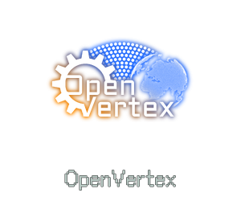

# OpenVertex

以开放协作驱动深度创新，连接数据、算法与工程，打造可复用、可扩展、可观测的现代技术栈。

## Logo

  

## 我们的使命
- 让高质量的工程与研究更易获取、更易复用
- 以开放标准与透明实现推动生态共建
- 面向生产的可观测、可维护、可伸缩实践

## 关注领域
- AI 与机器学习：训练、推理、评测、优化
- 数据与流处理：高可靠数据管道、指标与质量
- 云原生基础设施：容器、调度、服务网格、可观测性
- 开发者体验：CLI/SDK、模板与脚手架、自动化工作流

## 项目一览（示例占位）
- vertex-core：核心工具与通用组件
- vertex-ml：Model/数据管道、评测与部署
- vertex-observe：日志/指标/追踪的一体化方案
- vertex-cli：快速上手的命令行与模板生成器

欢迎通过 Issues 提交项目提案，或创建 Discussions 参与路线图制定。

## 为什么选择 OpenVertex
- 开放：默认开放协议，重视社区贡献与治理
- 工程化：以生产级质量为目标的设计与实现
- 可观测：从 Day 1 内建度量、日志与追踪
- 可扩展：模块化、插件化与清晰的接口边界

## 快速参与
1. 选择一个仓库并阅读其 README 与贡献指南
2. Fork 后创建分支进行更改
3. 提交 Pull Request，附带动机与测试说明
4. 在 Discussions/Issue 中与维护者协作完善

## 贡献指南
- 代码风格：遵循各仓库的 lint/format 规则与 CI 检查
- 提交信息：清晰、可追溯，附问题链接或设计说明
- 文档与示例：任何新增特性需包含最小可用示例
- 测试：保持或提升测试覆盖率，明确性能与资源假设
- 安全与合规：避免敏感信息，遵循依赖许可证

## 治理与发布
- 语义化版本：遵循 SemVer
- 变更日志：随每次发布自动生成
- 路线图：在组织 Discussions 中维护季度目标

## 社区
- Issues：反馈缺陷与需求
- Discussions：设计评审、路线建议与学习分享
- Releases：查看版本说明与升级指南

## 许可证
除非仓库另有声明，默认采用 Apache-2.0 或 MIT（以各子仓库 LICENSE 为准）。
